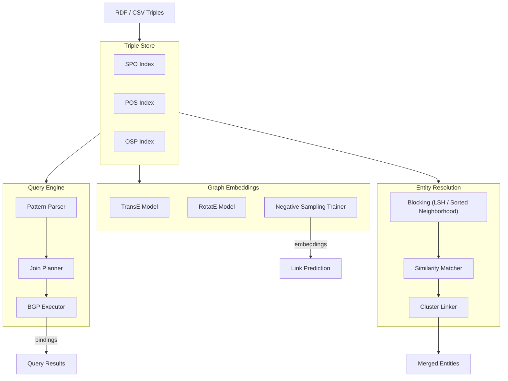
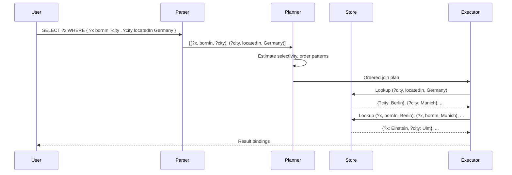
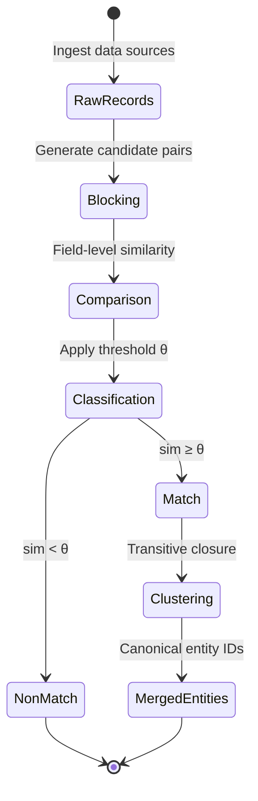

# Knowledge Graph Engine

A from-scratch knowledge graph system with an in-memory triple store, SPARQL-like query engine, graph embedding models (TransE, RotatE), and entity resolution via blocking and similarity. Supports RDF-style triples, pattern matching, path queries, and link prediction.

## Theory & Background

### Knowledge Graphs and Triple Stores

Most databases store data in rows and columns. Knowledge graphs take a different approach: they store facts as connections between things. Every fact is a triple — a subject, a predicate, and an object — like `(Einstein, bornIn, Ulm)`. This structure is natural for representing relationships: who works where, which drug targets which gene, which company owns which subsidiary. The triple store is the database engine that indexes these triples so you can ask questions about them efficiently.

Formally, given a set of entities $\mathcal{E}$ and relations $\mathcal{R}$, a knowledge graph is a set of triples:

```math
\mathcal{G} \subseteq \mathcal{E} \times \mathcal{R} \times \mathcal{E}
```

This says every fact in the graph connects two entities through a relation. Queries over the graph are expressed as patterns with variables. A basic graph pattern (BGP) is a set of triple patterns where some positions are variables. The query engine finds all variable bindings that satisfy every pattern simultaneously — equivalent to subgraph matching.

### SPARQL-like Query Evaluation

SPARQL is the standard query language for knowledge graphs, analogous to SQL for relational databases. The key difference: instead of joining tables, you join triple patterns. Each pattern matches against the graph, and the engine combines results where variables agree.

For a BGP with patterns $P_1, P_2, \ldots, P_n$, evaluation proceeds as:

```math
\text{eval}(P_1 \bowtie P_2 \bowtie \cdots \bowtie P_n) = \bigcap_{i=1}^{n} \{ \mu \mid \mu(P_i) \in \mathcal{G} \}
```

Here $\mu$ is a variable binding (a mapping from variable names to entities) and $\bowtie$ denotes the natural join over compatible bindings. The critical engineering challenge is making this fast. Index structures (SPO, POS, OSP) enable $O(1)$ lookup per pattern, making join-based evaluation practical even on graphs with millions of triples.

### Graph Embeddings: TransE and RotatE

Querying a knowledge graph only finds facts that are explicitly stored. But real-world graphs are incomplete — most possible true facts are missing. Graph embeddings solve this by learning continuous vector representations of entities and relations, then using those vectors to predict missing links.

The core intuition behind **TransE** is geometric: if the triple $(h, r, t)$ is true, then the head entity's embedding plus the relation vector should land near the tail entity's embedding. Relations are translations in embedding space:

```math
\mathbf{h} + \mathbf{r} \approx \mathbf{t}
```

The scoring function measures how plausible a triple is by computing the distance after translation:

```math
f(h, r, t) = -\|\mathbf{h} + \mathbf{r} - \mathbf{t}\|_{L_1 / L_2}
```

A lower distance means a more plausible triple. Training minimizes a margin-based ranking loss that pushes true triples to score higher than corrupted (false) triples:

```math
\mathcal{L} = \sum_{(h,r,t) \in \mathcal{G}} \sum_{(h',r,t') \in \mathcal{G}^{-}} \max\!\left(0,\; \gamma + f(h,r,t) - f(h',r,t')\right)
```

where $\gamma$ is the margin hyperparameter and $\mathcal{G}^{-}$ is the set of corrupted (negative) triples generated by replacing the head or tail with a random entity.

TransE is elegant but limited — it cannot model symmetric relations (if A is similar to B, then B is similar to A) or composition patterns. **RotatE** fixes this by moving to complex vector space, where each relation is a rotation rather than a translation:

```math
\mathbf{t} = \mathbf{h} \circ \mathbf{r}, \quad |\mathbf{r}_i| = 1 \;\forall i
```

Here $\circ$ is the Hadamard (element-wise) product and each relation component $\mathbf{r}_i$ has unit modulus — a rotation in the complex plane. A symmetric relation becomes a 180° rotation, inversion becomes the conjugate, and composition is just multiplying rotations. This geometric elegance lets RotatE capture relation patterns that TransE fundamentally cannot.

### Entity Resolution

In practice, the same real-world entity often appears under different names, spellings, or identifiers across data sources. Entity resolution identifies which records refer to the same thing. The naive approach — comparing every pair — is $O(n^2)$ and impractical at scale. The solution is a two-stage pipeline: **blocking** cheaply groups candidate pairs to avoid exhaustive comparison, then **matching** computes fine-grained similarity only on candidate pairs.

Given two entity sets $A$ and $B$, the similarity between entities $a$ and $b$ is a weighted combination of field-level similarities:

```math
\text{sim}(a, b) = \sum_{k=1}^{K} w_k \cdot \text{sim}_k(a.f_k, b.f_k)
```

where $\text{sim}_k$ is a field-level similarity function (Jaccard for token sets, Levenshtein for strings, cosine for embeddings) and $w_k$ are learned or hand-tuned weights. Pairs exceeding a threshold $\theta$ are declared matches, then transitive closure groups them into clusters.

### Tradeoffs and Alternatives

**TransE vs. RotatE**: TransE is simpler, faster to train, and works well when relations are mostly asymmetric and non-compositional. RotatE adds complexity (complex-valued embeddings, unit modulus constraints) but handles a broader class of relation patterns. For graphs dominated by hierarchical relations (isA, partOf), TransE is often sufficient. For graphs with symmetric or inverse relations (similarTo, marriedTo), RotatE is the better choice.

**Join ordering**: The query planner uses a greedy selectivity-based strategy — always evaluate the most selective pattern first. This is fast to plan but not globally optimal. An alternative is dynamic programming over join orderings (as in relational query optimizers), which finds the true optimum but has exponential planning cost. For typical BGPs with 3-6 patterns, greedy is within 10-20% of optimal.

**Blocking strategies**: LSH (MinHash) blocking is probabilistic — it may miss some true pairs. Sorted-neighborhood blocking is deterministic but only works well on fields with natural sort orders (names, dates). This engine supports both, letting users choose based on their data characteristics.

### Architecture



### Query Evaluation Pipeline



### Entity Resolution State Machine



### Embedding Training Timeline

```mermaid
gantt
    title Knowledge Graph Embedding Pipeline
    dateFormat X
    axisFormat %s

    section Data Prep
        Load triples           :0, 2
        Build entity/relation vocab :2, 3
        Generate negative samples   :3, 5

    section TransE Training
        Initialize embeddings  :5, 6
        Train epochs 1-50      :6, 12
        Train epochs 51-100    :12, 18

    section RotatE Training
        Initialize complex embeddings :5, 6
        Train epochs 1-50      :6, 13
        Train epochs 51-100    :13, 20

    section Evaluation
        Link prediction (MRR, Hits@K) :20, 23
        Export embeddings      :23, 24
```



### Key References

- Bordes et al., "Translating Embeddings for Modeling Multi-relational Data" (2013) — [NeurIPS](https://papers.nips.cc/paper/2013/hash/1cecc7a77928ca8133fa24680a88d2f9-Abstract.html)
- Sun et al., "RotatE: Knowledge Graph Embedding by Relational Rotation in Complex Space" (2019) — [arXiv:1902.10197](https://arxiv.org/abs/1902.10197)
- Pérez et al., "Semantics and Complexity of SPARQL" (2009) — [ACM TODS](https://dl.acm.org/doi/10.1145/1567274.1567278)
- Christophides et al., "Entity Resolution in the Web of Data" (2015) — [Synthesis Lectures](https://doi.org/10.2200/S00655ED1V01Y201507WBE013)
- Fellegi & Sunter, "A Theory for Record Linkage" (1969) — [JASA](https://www.jstor.org/stable/2286061)

## Real-World Applications

Knowledge graphs power systems that need to connect, query, and reason over complex relationships at scale. The combination of structured querying, link prediction, and entity resolution makes them a backbone technology across industries that deal with fragmented or interconnected data.

| Industry | Use Case | Impact |
|----------|----------|--------|
| Pharmaceutical | Mapping drug-gene-disease interactions to accelerate drug discovery and repurposing | Reduces candidate screening time from years to months by surfacing hidden biological connections |
| Financial Services | Detecting fraud networks by linking accounts, transactions, and entities across institutions | Identifies complex fraud rings that rule-based systems miss, reducing losses by 20-40% |
| Enterprise IT | Unifying knowledge across wikis, tickets, and documentation into a searchable corporate knowledge graph | Cuts employee time spent searching for information by 30%, improves onboarding speed |
| Supply Chain | Tracing supplier relationships, component dependencies, and risk propagation across tiers | Enables proactive risk management by revealing hidden single-source dependencies |
| Healthcare | Resolving patient records across hospitals and clinics to build unified longitudinal health profiles | Reduces duplicate tests and conflicting treatments, improving care coordination and reducing costs |

## Project Structure

```
knowledge-graph-engine/
├── src/
│   ├── __init__.py
│   ├── store/
│   │   ├── __init__.py
│   │   ├── triple_store.py        # In-memory triple store with SPO/POS/OSP indexes
│   │   ├── rdf_parser.py          # N-Triples / Turtle parser
│   │   └── serializer.py          # Export to N-Triples / JSON-LD
│   ├── query/
│   │   ├── __init__.py
│   │   ├── parser.py              # SPARQL-like pattern parser
│   │   ├── planner.py             # Join ordering and selectivity estimation
│   │   ├── executor.py            # BGP evaluation with index nested-loop join
│   │   └── path_query.py          # Reachability and shortest-path queries
│   ├── embeddings/
│   │   ├── __init__.py
│   │   ├── transe.py              # TransE embedding model
│   │   ├── rotate.py              # RotatE embedding model
│   │   ├── trainer.py             # Negative sampling trainer
│   │   └── link_predictor.py      # Top-k link prediction
│   └── resolution/
│       ├── __init__.py
│       ├── blocker.py             # LSH and sorted-neighborhood blocking
│       ├── matcher.py             # Field-level similarity (Jaccard, edit distance)
│       └── linker.py              # Transitive closure clustering
├── configs/
├── data/
│   └── sample_graph/
├── requirements.txt
├── .gitignore
└── README.md
```

## Quick Start

```bash
pip install -r requirements.txt

# Load triples and run a query
python -m src.store.triple_store --input data/sample_graph/triples.nt

# Run a SPARQL-like query
python -m src.query.executor --query "SELECT ?x WHERE { ?x bornIn ?city . ?city locatedIn Germany }"

# Train TransE embeddings
python -m src.embeddings.trainer --model transe --epochs 100 --dim 128

# Run entity resolution
python -m src.resolution.linker --input data/sample_graph/duplicates.csv --threshold 0.8
```

## Implementation Details

### What makes this non-trivial

- **Triple indexing**: The store maintains three hash-map indexes (SPO, POS, OSP) so any triple pattern — regardless of which positions are bound — resolves in $O(1)$. This is the same strategy used by production triple stores like Jena TDB.
- **Join planning**: The query planner estimates pattern selectivity from index cardinalities and orders joins to minimize intermediate result size. This avoids the combinatorial explosion that naive nested-loop joins produce on multi-pattern queries.
- **Negative sampling for embeddings**: Training TransE/RotatE requires generating corrupted triples that are not in the graph. The trainer uses type-constrained corruption (replacing head/tail with entities of the same type) to produce harder negatives and faster convergence.
- **Blocking for entity resolution**: Comparing all entity pairs is $O(n^2)$. The blocker uses locality-sensitive hashing (MinHash on token sets) to reduce candidates to near-linear, while the sorted-neighborhood method provides a deterministic alternative for structured fields.
- **Complex-space rotations**: RotatE operates in complex vector space where each relation is a rotation. This elegantly captures relation patterns (symmetry, inversion, composition) that translation-based models cannot represent, with each relation component $\mathbf{r}_i$ constrained to $|\mathbf{r}_i| = 1$.
